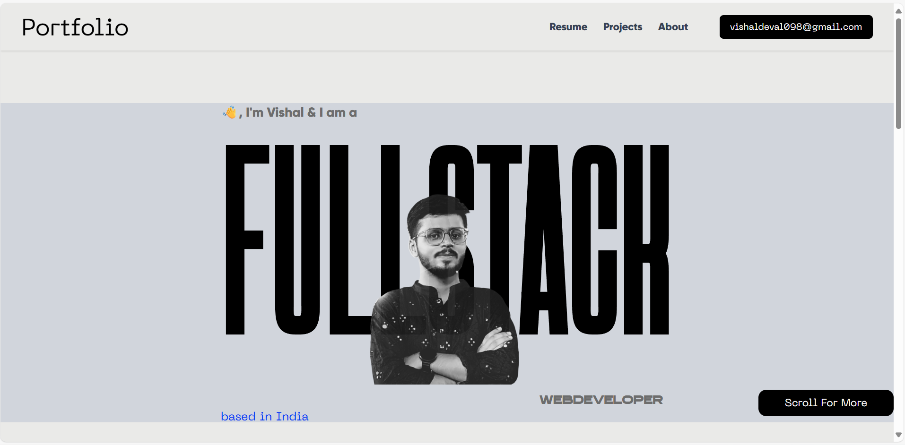
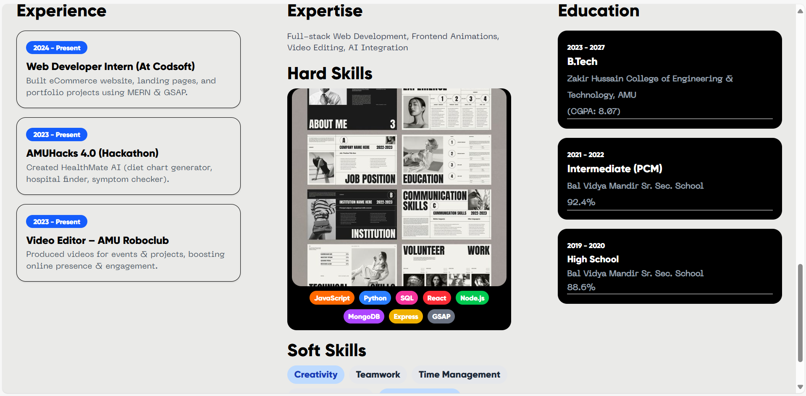

# 🌐 Personal Portfolio  

A modern and responsive **Personal Portfolio Website** built with **React, Vite, Tailwind CSS, and JavaScript** to showcase my projects, skills, and achievements.  

🚀 **Deployed on:** [My Portfolio](https://myportfolio-coral-rho-96.vercel.app/)  

---

## 📌 **Features**  

- 🎨 **Modern UI/UX** – Clean and responsive design  
- 📱 **Mobile-Friendly** – Works seamlessly on all devices  
- ⚡ **Fast & Optimized** – Lightweight and performance-focused  
- 📂 **Projects Showcase** – Highlights my best work  
- 🧑‍💻 **About Me Section** – Introduction and career journey  
- 📬 **Contact Form / Links** – Easy way to connect with me  

---

## 🛠️ **Tech Stack**  

- **Frontend:** React, Vite, JavaScript  
- **Styling:** Tailwind CSS  
- **Animations:** GSAP  
- **Deployment:** Vercel / Netlify / GitHub Pages  

---

## 📸 **Preview**  

  
  

---

## 📂 **Folder Structure**  

```bash
portfolio/
├── public/
├── src/
│   ├── components/
│   ├── assets/
│   ├── App.jsx
│   └── main.jsx
├── package.json
└── README.md

🔗 Live Demo

👉 View Portfolio

📬 Contact

📧 Email: vishaldeval098@gmail.com

🔗 LinkedIn: https://www.linkedin.com/in/vishal-deval-0a1283296/

💻 GitHub: https://github.com/VishalDeval

✨ Made with ❤️ by Vishal Deval